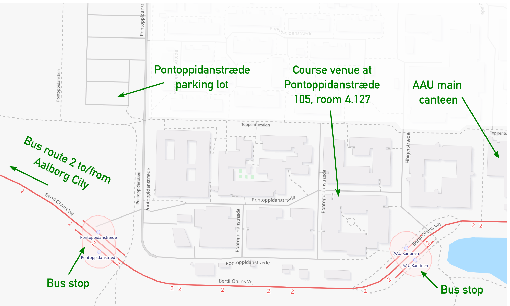

## Address
The course will take place in Aalborg at [AAU Energy, Pontoppidanstraede 105 (room 4.127), 9220-Aalborg East, AAU Energy, Denmark](https://www.google.com/maps/@57.0161838,9.9741514,429m/data=!3m1!1e3).

## Suggestions for accomodation

There are several hotels nearby. You can choose to stay at the campus area or in the city centre where a bus leaves frequently to campus area. Is takes approx 15 min to get from city centre to campus area.

**Accomodation in city area**
- [Cabinn Aalborg](https://www.cabinn.com/hotel/cabinn-aalborg) (cheaper option)
- [Radisson Blu Limfjord Hotel](https://www.radissonhotels.com/en-us/hotels/radisson-blu-aalborg-limfjord)

**Accomodation in campus area**
- [Scandic Aalborg East](https://www.scandichotels.com/hotels/denmark/aalborg/scandic-aalborg-ost)

